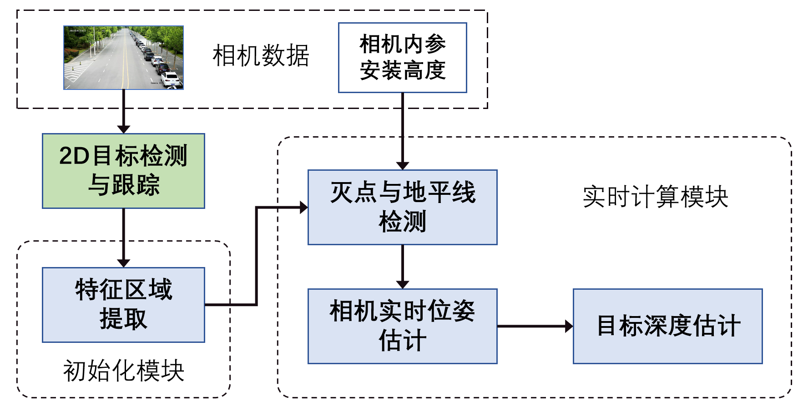
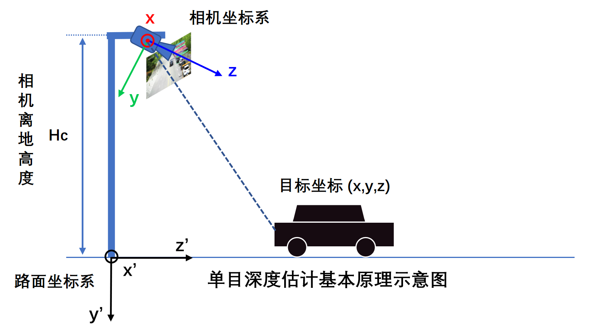
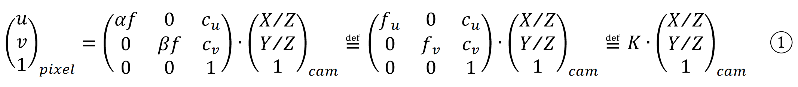
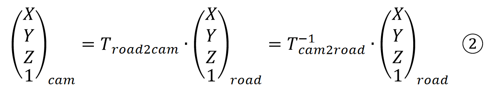
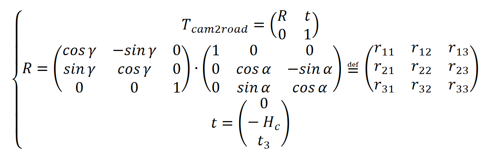
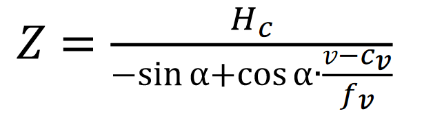
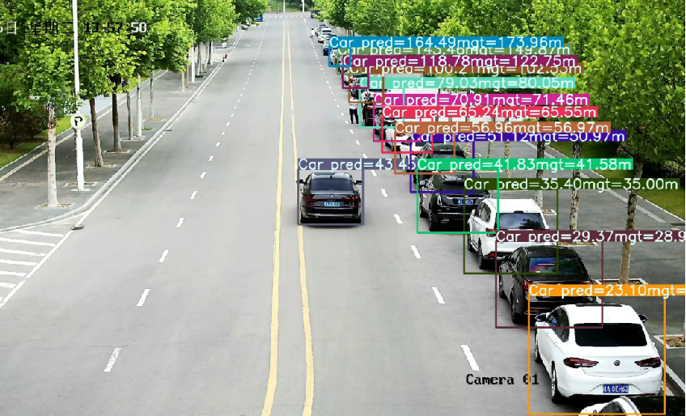

# **Geometry-Aware Roadside Depth Estimation Toolkit (GARD)**
<font size=5>
路侧单目深度估计算法工具箱（GARD）是一个目标级单目深度估计算法库，旨在提供一套基于路侧摄像头视角的低成本、高泛化纯视觉测距与3D感知的解决方案。基于2D检测结果与环境几何特征检测，本工具通过后处理的方式对目标3D坐标与速度信息进行重建，其算法核心是基于透视成像的数学原理，无需大量数据进行算法训练，并可在cpu平台进行快速计算。</font>
<br />
<br />
<br />


# **算法流程图**：
<font size=5>
本算法库整体处理流程示意图如下，主要包括两个模块：<br />
 <br />
<ol>
<li>初始化模块：该阶段包括参数初始化模块和自动化感兴趣区域（ROI）提取模块，作用分别是初始化算法运行所需内部参数和提取画面中的路面区域。</li>
<li>实时计算模块：该阶段基于实时画面的图像数据和提取到的ROI区域，对2D感知结果进行深度估计，并以此重建目标的3D坐标。</li>
</ol>
</font>
<br />


# **原理示意图**：
<font size=5>
本算法基本原理示意图如下图所示：<br />
<br />

<br />

- [ ] 相机坐标系（o-x-y-z）：     z轴是相机成像系统的光轴，指向正前方；x轴平行于地面向右</li>
- [ ] 路面坐标系（o‘-x‘-y‘-z‘）： z‘轴与相机成像的光轴在同一垂直于地面的竖直平面内并指向前方；x’轴在地平面内且与相机的x轴平行</li>

根据针孔相机成像模型，有：
<br />
<br />
其中，(u,v)是待估计点在2D像素平面的坐标，(x,y,z)是该点在相机三维坐标系中的坐标，K是相机内参。<br />
<br />
利用相机坐标系和路面坐标系之间的外参关系，容易得：<br />
<br />
<br />
<br />
其中，转换矩阵T满足：<br />
<br />
<br />
<br />

联立以上方程，并且利用局部地平假设，容易解得目标的深度z，此处从略。<br />
下面仅给出当相机相对于地面的横滚角近似趋于0时的深度估计方程：<br />
<br />
<br />
</font>

# **算法效果**：
<font size=5>
本算法工具在中科大先进技术研究院测试效果如下图所示：<br />
<br />
<br />
<br />
在该场景下200米范围内算法深度估计结果的均方根误差（RMSE）不超过5%。
</font>

<!--
<iframe height=540 width=1024 src="demo/results_demo.mp4"">
</iframe>
-->

<!--
<video id="video" controls="" preload="none">
    <source id="mp4" src="demo/results_demo.mp4" type="video/mp4">
</video>
-->
<br />
<br />


# **Demo演示**：

```
python3 scripts/object_detector.py
```
***

# **关于我们**
- [ ] [实验室主页: Sonic智能驾驶团队](http://www.sonic-car.net/#team)
- [ ] 联系方式：wbb@iai.ustc.edu.cn


## **License**
MIT license
