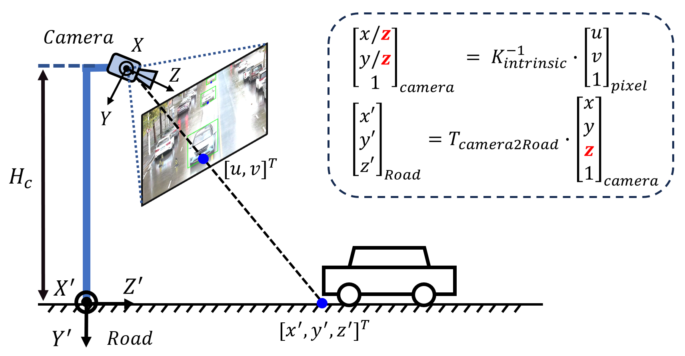
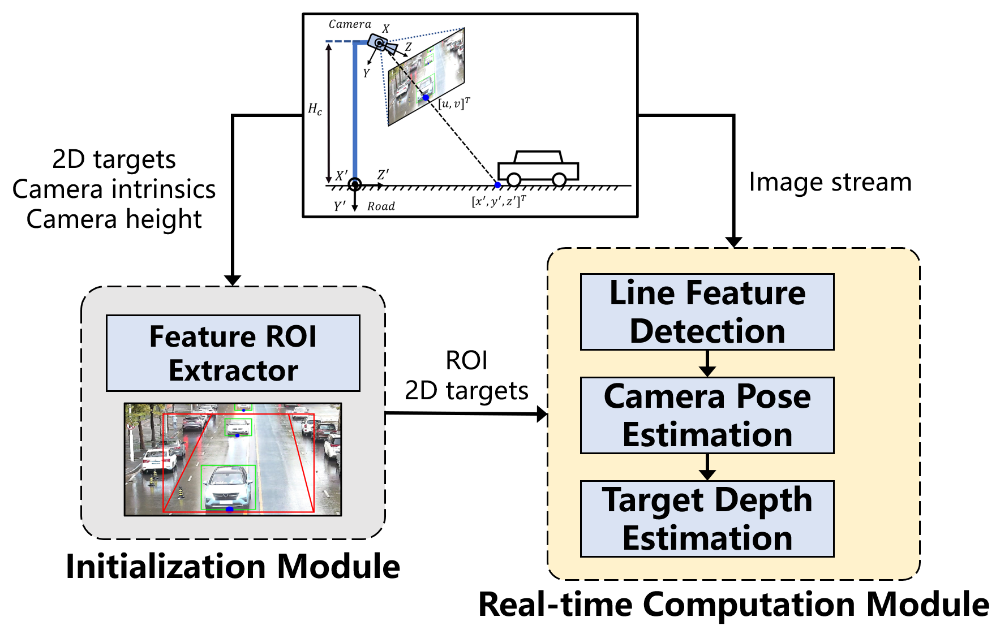
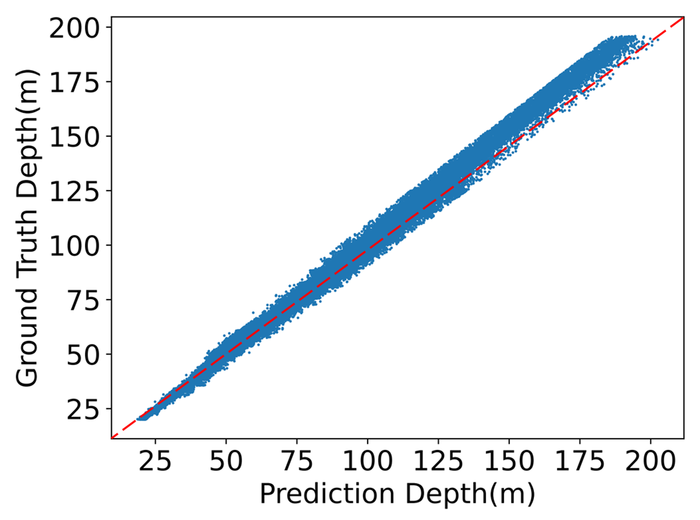
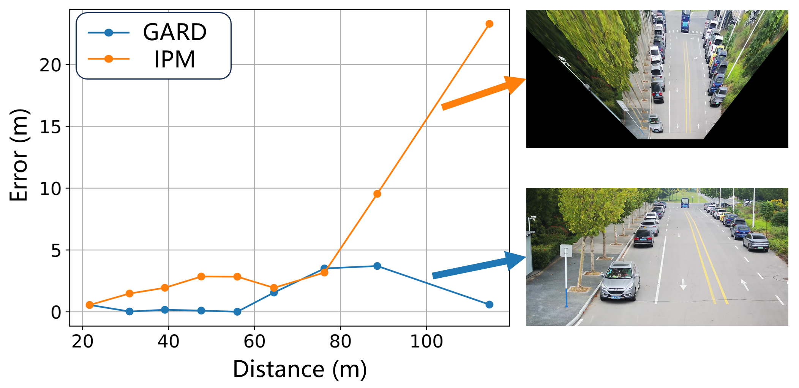

# Geometry-Aware Roadside Monocular Depth Estimation Tool (GARD)
## Introduction

Geometry-Aware Roadside Monocular Depth Estimation (GARD) is an object-level monocular depth estimation algorithm library. It aims to provide a solution for low-cost, highly generalized camera-based object ranging and 3D perception from the perspective of roadside cameras. Leveraging 2D detection results and environmental geometric features, this tool reconstructs the 3D coordinates and velocity information of targets through post-processing. Its algorithmic core relies on the mathematical principles of perspective imaging, requiring minimal data for training and enabling fast computation on CPU platforms.

The application scenario of GARD is roadside monocular cameras. The coordinate systems and basic principles are illustrated in the diagram below：
<div align=center></div>

Note： $K_{intrinsic}$ is the intrinsic parameters of the camera, $T_{camera2Road}$ is the transformation matrix from camera to the road coordiate system, which is defined by the height of the camera from local ground surface and its pose angles.

## Latest News
2023-12: paper under review, code snipets, libs along with the core API are released for testing.<br />
2023-09: paper submitted to a certain conference.

## System Architecture
The overall architectural diagram of the GARD algorithm is shown below, primarily comprising two modules: the initialization module and the real-time computation module.

<div align=center></div>

1. **Initialization Module**: in addition to loading the configuration parameters required for execution, this module primarily involves the automated extraction of regions of interest (ROIs), which is designed to automatically determine the area for line feature extraction based on target detection results over a certain period of time. This process aims to exclude feature noise effects caused by roadside buildings, vegetation and the targets themselves."
2. **Real-time computation module**: it operates based on the image stream data from the camera and the initialized ROI to perform vanishing point detection and calculates the camera’s pose angles. Then, by leveraging this pose information, it estimates the depth of targets inside the 2D bounding boxes and reconstructs the 3D coordinates of them.

## Major features
GARD possesses the following characteristics:
- It enables 3D perception of targets using only well-calibrated camera intrinsic parameters and the camera’s installation height, without the need for training data.

- The target ranging method of GARD is based on geometric constraints and the mathematical model of camera imaging, offering fast inference speed without the need for GPU or additional computational resources.
  
- It surpasses the industry-standard Inverse Perspective Mapping (IPM) method in terms of accuracy and stability.


## CPU Benchmark
On CPU, using images with a resolution of $4096\times 2160$ pixels as input, the computation time for the three steps in the real-time computation module are as follows (in milliseconds, ms)
| LineFeatureExtractor | CameraPoseEstimator  |  TargetDepthEstimator |
|-------------------|-------------------------|----------------------|
| 20 ms             | 5 ms                    | 1 ms                  |

## Distance Estimation Accuracy
- Testing with the DAIR-V2X dataset yields the following ranging accuracy:
<div align=center></div>

- Under the environment of a university campus, a comparison between the results from the deployed GARD and the IPM method is shown below.
<div align=center></div>

## Getting Started
### 1. Prerequisites
- Data：camera images from a roadside perspective is required, with input data sourced either from RTSP video streams or independent MP4 files
- 2D image detector: GARD relies on accurate 2D detection bounding boxes, therefore, prior 2D detection processing is necessary. This repository integrates a 2D detector, and details about its prerequisites can be found in https://github.com/WongKinYiu/yolor
- Hardware：Nvidia RTX 3060 or higher is prefered
- Runtime environment：listed in requirements.txt

### 2. Install & Test
- Clone the repository:
```
git clone https://github.com/SonicAutoDrive/GARD.git
```

- Install dependencies:
```
pip install -r requirements.txt
```
- Run the project with a designated mp4 file (we provide a demo file under demo/):
```
python3 scripts/object_detector.py path_to_the_mp4_file
```

- To stop/cancel the running, press Q on the keyboard


## License
GraphScope is released under [Apache License 2.0](https://www.apache.org/licenses/LICENSE-2.0).

## Cite
```bibtex
@misc{GARD2023,
  title={Geometry-Aware Roadside Monocular Depth Estimation Tool},
  author={Beibei Wang, Yuru Peng},
  howpublished = {\url{https://github.com/SonicAutoDrive/GARD}},
  year={2023}
}
```

## TODO
- Paper of this work will be released on arxiv.org anytime soon. 
- The upcoming version 2.0 will introduce more features.

## Contact Information
- Email: wbb_ustc@163.com
- GitHub: [SonicAutoDrive](https://github.com/SonicAutoDrive)
