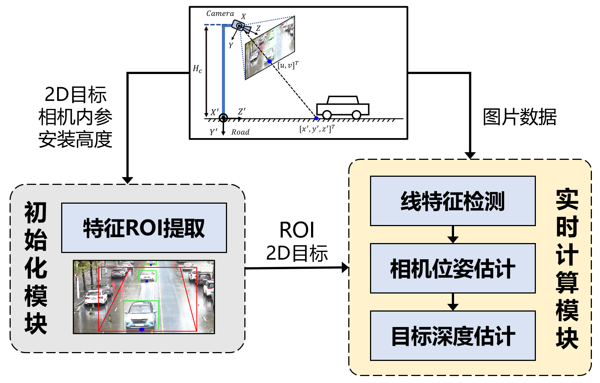

# 基于几何约束的路侧深度估计方法 (GARD)
## Introduction

基于几何约束的路侧单目深度估计方法（Geometry-Aware Roadside Monocular Depth Estimation, GARD）是一个目标级单目深度估计算法库，旨在提供一套基于路侧摄像头视角的低成本、高泛化纯视觉测距与3D感知的解决方案。基于2D检测结果与环境几何特征检测，本工具通过后处理的方式对目标3D坐标与速度信息进行重建，其算法核心是基于透视成像的数学原理，无需大量数据进行算法训练，并可在cpu平台进行快速计算。

GARD的应用场景是路侧单目相机，坐标系及基本原理如下图所示：
<div align=center></div>

注： $K_{intrinsic}$ 是相机内参, $T_{camera2Road}$ 是相机坐标系下的点到路面坐标系中的旋转平移变换矩阵，由相机高度$H_{c}$, 以及相机相对于地面的姿态角度决定。

## Latest News
2023-12: 论文审稿中，测试代码已开源并开放核心api

2023-09: 相关论文已提交学术会议。

## System Architecture
GARD算法整体处理架构示意图如下，主要包括两个模块：初始化模块与实时计算模块

<div align=center></div>

1. 初始化模块：该模块除了载入算法运行所需配置参数以外，主要涉及的功能是自动化感兴趣区域（ROI）提取，作用是根据一段时间内的目标检测结果自动确定线特征提取区域，以排除路边建筑物、植物以及目标自身带来的特征噪声影响。
2. 实时计算模块：该阶段基于相机实时画面和初始化获得的ROI区域，首先进行灭点检测，然后计算相机位姿角度，再利用位姿信息对2D感知结果进行深度估计，并以此重建目标的3D坐标。

## Major features
GARD算法具备以下特点：
- GARD对目标进行3D感知只需标定好的相机内参以及相机安装高度，无需训练数据

- GARD的核心测距方法是基于几何约束与相机成像的数学模型，推理速度快且无GPU以及额外算力消耗
  
- 在精度与稳定性上胜过业界流行的逆透视变换（IPM）方法


## CPU Benchmark
基于CPU，以$4096\times 2160$ 分辨率图片为输入，GARD的实时计算模块中三个步骤的计算耗时如下（毫秒，Intel i7-12700 CPU）：
| 线特征检测（LineFeatureExtractor） | 相机位姿估计（CameraPoseEstimator)  |  目标深度估计（TargetDepthEstimator) |
|-------------------|-------------------------|----------------------|
| 20 ms             | 5 ms                    | 1 ms                 |

## Distance Estimation Accuracy
- 基于DAIR-V2X数据集进行测试，深度预测的精度如下：
<div align=center></div>

- 基于中科大先进技术研究园区实际部署测试结果与IPM算法对比效果如下：
<div align=center></div>

## Getting Started
### 1. Prerequisites
- 数据：使用GARD需要有路侧视角的摄像头数据，以取RTSP视频流或者独立的mp4文件为输入数据。
- 视觉2D检测模型：GARD依赖准确的视觉2D检测框，因此需要先进行视觉2D检测的处理。本项目集成了一个2D检测器YOLO-R，关于其prerequisites，详见 https://github.com/WongKinYiu/yolor
- 硬件环境：Nvidia RTX 3060 or higher is prefered
- 算法环境：listed in requirements.txt

### 2. Install & Test
- Clone the repository:
```
git clone https://github.com/SonicAutoDrive/GARD.git
```

- Download YOLO-R model weights (put the weight file under include/object_detection_2d/YOLOR/weights/):
```
百度网盘链接: https://pan.baidu.com/s/1wSCFXksgQe9TdYNZ9mCzcA
提取码: ecsd 
```

- Install dependencies:
```
pip install -r requirements.txt
```
- Run the project with a designated mp4 file (we provide a demo file under demo/):
```
python3 scripts/object_detector.py path_to_the_mp4_file
```

- To stop/cancel the running, press Q on the keyboard


## License
GraphScope is released under [Apache License 2.0](https://www.apache.org/licenses/LICENSE-2.0).

## Cite
```bibtex
@misc{GARD2023,
  title={Geometry-Aware Roadside Monocular Depth Estimation Tool},
  author={Beibei Wang, Yuru Peng},
  howpublished = {\url{https://github.com/SonicAutoDrive/GARD}},
  year={2023}
}
```

## TODO
- Paper of this work will be released on arxiv.org anytime soon. 
- The upcoming version 2.0 will introduce more features.

## Contact Information
- Email: wbb_ustc@163.com
- GitHub: [SonicAutoDrive](https://github.com/SonicAutoDrive)
